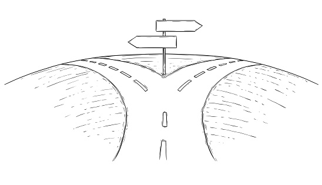

# I Did Not Think It Was For Me

Honestly going into college I believed that I would focus more on the hardware side of the computer. Slowly I became more interested in the software side of things. I learned to enjoy coding and dare I say became decent at it. While there still is this part of me that likes the small intricate machinery that makes a computer run, I feel more confident in being able to work with websites, applications, and more. Even though I still feel like there is a long path ahead of me I feel more focused about which coding langauges to practice, the type of programs to research, and the projects I want to do.

# What Does My Future Look Like?

In the next few years I hope, like many others, to have a secure job. Considering my interests it probably would be a Front/Back end development job or a programming job in the video game industry, it doesn't have to be related to games I just think it would be cool. Hopefully by then I have managed a few projects outside of school. A few of my friends have been creating a website but I think the project was put on hold due to school and work. I want to be able to resume that project and have something that I can be proud of. Not to mention all the skills I would be practicing throughout the course of the project.

# Have To Get There First

Speaking about skills, the first thing I have to do is create a good foundation in terms of coding language proficiency. Eventually I want to be extremely proficient in about 4 or 5 languages but that is yeares into the future. Whilst ICS 314 will help me with good writing and collboartion skills, projects with peers will teach me a lot more about collaboartion and time management. Currently, I do struggle with time management but in the field not only do you need to make sure you are keeping up but your teammates as well. I understand that I have to double down and spend more time preparing considering I am already senior, hopefully I am able to stick to my goals and enjoy the type of work I produce. 
