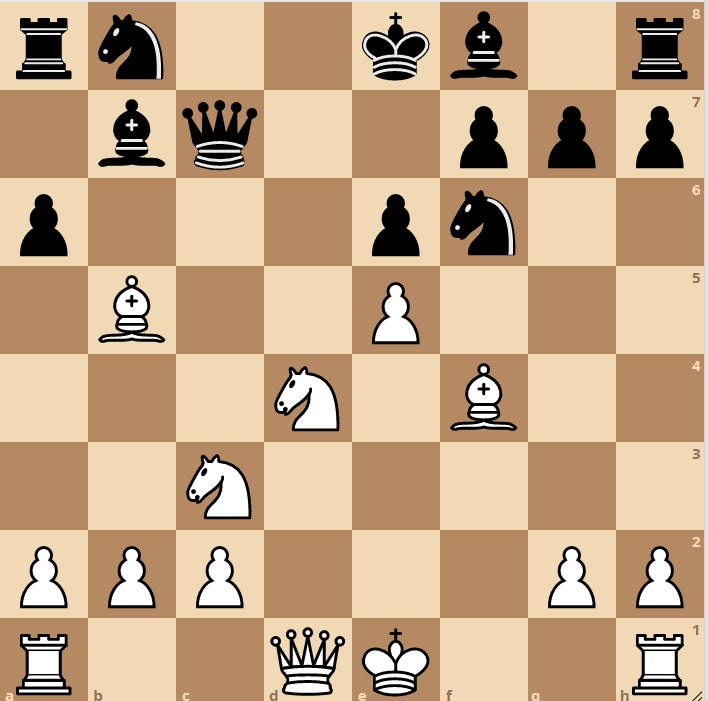
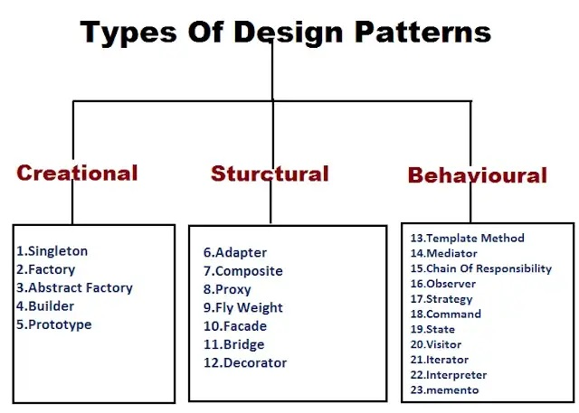

  
 

If you have a relatively in-depth knowledge on how to play chess, you know that pattern recognition is an important skill. Patterns allow you to solve certain problems while being able to easily recognize the strength and weaknesses of the solution. This is how I imagine design patterns. 

The code used can follow certain patterns and recognizing that a design pattern is applicable will speed up the process by putting you into a more manageable or known "position." Pattern recognition as a whole is a important skill to have in coding as well. Being able to know how to solve a problem by utilizing concepts from previous code or online code is a skill I have been taught to hone. Knowing what a pattern can or can't do can also help other design choices in the project.

  
 

# Know Your Position

Design patterns are strong tools that can elevate the way you code. However, to truly utilize the strength of them you need to understand the externals of the pattern. How it interacts in your design and knowing what changes to make around it is just as important as the design itself.

I still am new to design patterns but, a specific example I personally use would be the module pattern. Modularization is a skill I learned about even before this course. Splitting up functions and prototypes made functions more secure and made making small changes easier. 

However, just like all the other design patterns you need to realize that having multiple files can make it messy when debugging because you have to chase around functions and variables. Knowing that I try to choose want things are modularized and try to understand what comes from where first. I circumvent the cons because I have an understanding of the pattern.

