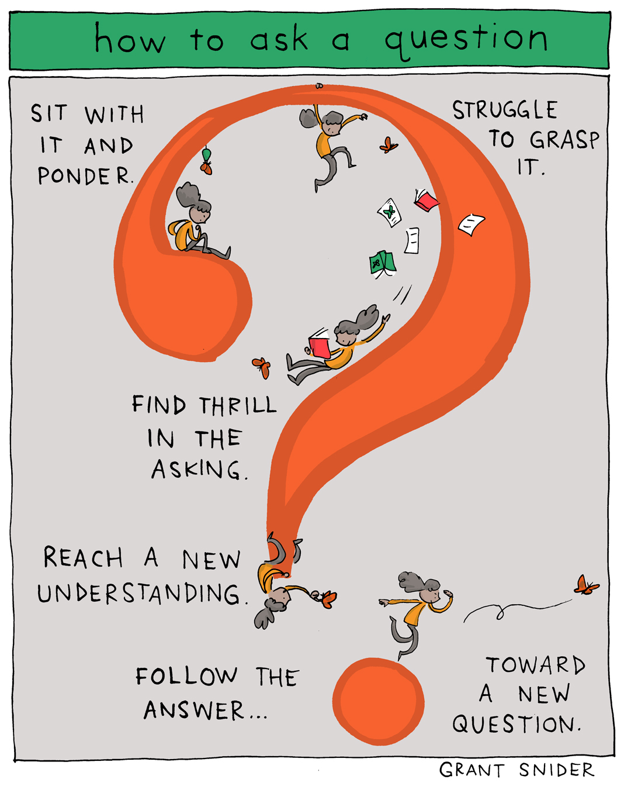

## You won't sound dumb (probably)

Now I don't want to discourage anybody from asking questions. I believe asking questions are important and even if the answer may be obvious in hindsight at least the experience will help you. However, I do believe asking questions is a skill that needs to be learned and practiced. In the software engineering field there is so much room for diversity. There are many different coding languages, environments, there could be issues with the hardware or bugs from other programs. Being able to ask good questions will allow you to find good answers and learn more. Let's take a look at stack overflow, a website used by programmers to help ask and answer questions relating to a multitude of coding related areas.

```
Q: How can I pivot a dataframe?

The problem with existing questions and answers is that often the question is focused on a nuance that the OP has trouble generalizing in order to use a number of the existing good answers. However, none of the answers attempt to give a comprehensive explanation (because it's a daunting task)

Look a few examples from my Google Search

How to pivot a dataframe in Pandas?
Good question and answer. But the answer only answers the specific question with little explanation.
pandas pivot table to data frame
In this question, the OP is concerned with the output of the pivot. Namely how the columns look. OP wanted it to look like R. This isn't very helpful for pandas users.
pandas pivoting a dataframe, duplicate rows
Another decent question but the answer focuses on one method, namely pd.DataFrame.pivot
So whenever someone searches for pivot they get sporadic results that are likely not going to answer their specific question.

Question(s)
Why do I get ValueError: Index contains duplicate entries, cannot reshape

How do I pivot df such that the col values are columns, row values are the index, and mean of val0 are the values?

 col   col0   col1   col2   col3  col4
 row
 row0  0.77  0.605    NaN  0.860  0.65
 row2  0.13    NaN  0.395  0.500  0.25
 row3   NaN  0.310    NaN  0.545   NaN
 row4   NaN  0.100  0.395  0.760  0.24

```

The question actually has a lot more information then shown above and I highly encourage you to look at it [here](https://stackoverflow.com/questions/47152691/how-can-i-pivot-a-dataframe). The creator of the question includes code that they are testing as well as other questions relating, 11 of them to be exact. Now the only gripe I have with this is it might be too much. Yet there is a lot of good in it. The person has shown that they have down previous research and has done some experimentation. 

```
A:
Examples
What I'm going to do for each subsequent answer and question is to answer it using pd.DataFrame.pivot_table. Then I'll provide alternatives to perform the same task.

Question 3
How do I pivot df such that the col values are columns, row values are the index, mean of val0 are the values, and missing values are 0?

pd.DataFrame.pivot_table

fill_value is not set by default. I tend to set it appropriately. In this case I set it to 0. Notice I skipped question 2 as it's the same as this answer without the fill_value

aggfunc='mean' is the default and I didn't have to set it. I included it to be explicit.

    df.pivot_table(
        values='val0', index='row', columns='col',
        fill_value=0, aggfunc='mean')

    col   col0   col1   col2   col3  col4
    row
    row0  0.77  0.605  0.000  0.860  0.65
    row2  0.13  0.000  0.395  0.500  0.25
    row3  0.00  0.310  0.000  0.545  0.00
    row4  0.00  0.100  0.395  0.760  0.24
pd.DataFrame.groupby

  df.groupby(['row', 'col'])['val0'].mean().unstack(fill_value=0)
pd.crosstab

  pd.crosstab(
      index=df['row'], columns=df['col'],
      values=df['val0'], aggfunc='mean').fillna(0)
```
 
The way they worded the question has allowed them to extract more information as we can see from the responses. In this particular answer they have recieved a direct answer along with alternative methods. This is because they provided people with adequate information to get the exact answer they are looking for. They can even test the code given to them as a bonus.

## What should you avoid?

I suggest doing your own personal research first because you may find out another person has had the same problem as you. If you are resorting to posting on a forum try to gather all possible information needed before posting. A good bad example is like the question below.

```
Q: Python Old object information being kept

I'm making a class of rooted Trees using a class of Nodes that have a "word" of the form [1,1,2], where [1,1] is the parent of [1,1,2] and [1,1,1] is the preceding sibling of [1,1,2], a list of children, and a parent. For some reason, in the for loop section, the second time the line nextChild = Node(word) it is taking as input one child (which is the previous nextChild) even though I am not passing in anything as the child. I have no idea why this is happening. I'll post more code if requested.

```
Note that this is the original question without the edit. The edit adds a section of code to look at, which you can also look at [here](https://stackoverflow.com/questions/24320779/python-old-object-information-being-kept). The asker didn't end up getting a proper answer only redirections to other forum posts due to no code present to test and debug. The fact that they had to incorporate the code afterwards meant it was too late and most likely was covered by other questions. 

Again this doesn't mean to stop asking questions. You should just know how to ask them and improve on it. It is a powerful skill that everyone can use. I still have trouble asking questions but it takes time.


