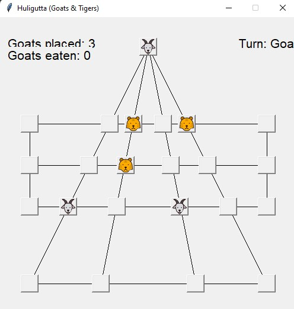

# How Does the Game Work?

Huligutta is a 2-player board game originating from India. The board itself consists of a triangle with a super-imposed rectangle in the middle. The board has multiple nodes that denotes where an animal, the tiger or goat can go. One player is a goat that is trying to corner the tigers, and the other is a tiger who is trying to eat a certain number of goats. The goat player can place a maximum of 15 goats and afterwards must move a goat if the max is reached. The tiger can only eat the goat if there is a space on the other side said goat; think of checkers.

For the course I have worked on testing the game and making minor additions to the code. Near the end of EE396 we began to learn about information theory from our Wordle project, and about machine learning. We are currently working on improving our AI which already uses machine learning ideas made by previous students.

# Teaching An AI To Win

As I am taking EE496 currently, we are planning on working on implementing a different machine learning algorithm to the AI. The plan is to separate the students to learn about topics such as boosting, inverse reinforcement learning, and applying neural networks. A large portion of the class is also working on our presentation skills and hopefully I can present all these topics in the future.
