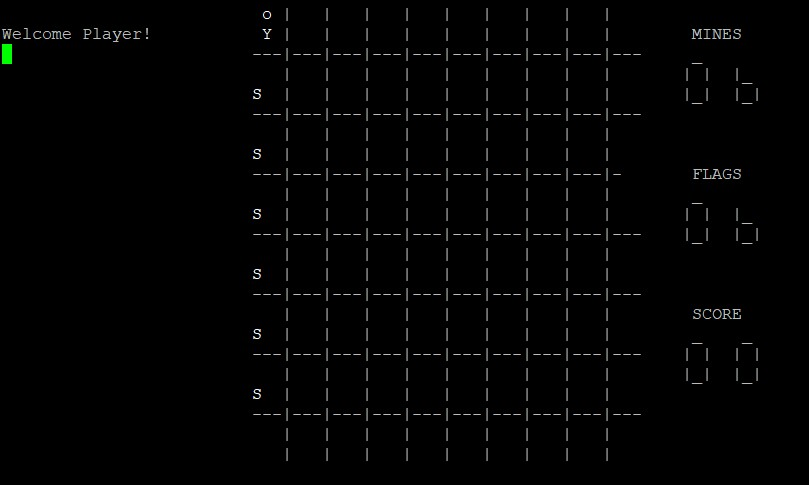

Timmy Finds The Exit was a project which used a pre-existing interface given to use by our professor. Our task was to implement the game itself. The board itself resembles minefield where the depending on your position there is a number showing how much mines you are next to. The main goal of the game is to get through to the other side.

A secondary goal is getting a better score by traversing more spaces and flagging where the bombs are. Playing the game is played with using the keys around the j key. The lowercase keys (y,u,i,h,k,b,n,m) are used for movement. While inputing the uppercase keys (Y,U,I,H,K,B,N,M) places a flag down. Remember you only have a limited amount of flags. An example of t

