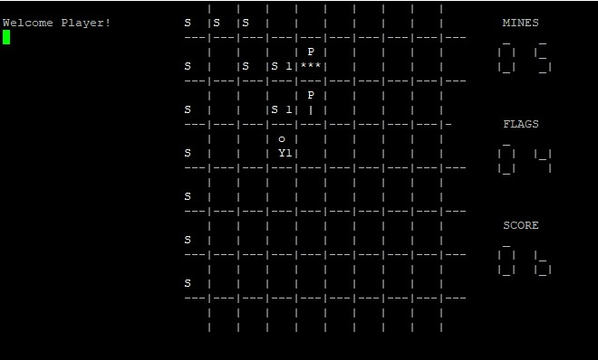

Timmy Finds The Exit was a project which used a pre-existing interface given to use by our professor. The project was a cumulation of everything we learned in the course and was our task was to implement the game itself. The board itself resembles minefield where the depending on your position there is a number showing how much mines you are next to. The main goal of the game is to get through to the other side. A secondary optional goal is getting a high score by passing through spaces or planting flags on bombs.

To start the game, you first must choose your difficulty which changes the number of mines present in the field. Playing the game is played with using the keys around the j key. The lowercase keys (y,u,i,h,k,b,n,m) are used for movement. While inputting the uppercase keys (Y,U,I,H,K,B,N,M) places a flag down. The player only has a limited number of flags that match the number of bombs on the field. Eventually you will either hit bomb and lose or pass to the right side of the board and win.

Overall, I found the project fun but a tough challenge. I had to go through 2 different versions which used entirely different approaches before settling on something that worked. Unfortunately, I was not able to complete the entire project, failing to implement a few more difficulties. I have been wanting to go back to redo the project but haven't been able to learn how to make my own GUI in any coding language I have learned.

